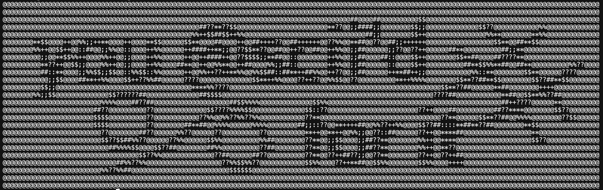

# You @scii'd For It
A simple program that converts an image into a copyable string of ASCII characters.

### How to Use
You need to have Python and the [Pillow](https://pillow.readthedocs.io/en/stable/installation.html) library installed.
Once installed, do `python3 converter.py`. You should be prompted to input a path (e.g. *~/Desktop/Images/image.png*), followed by a resize factor (for smaller resizes, try 25; for larger resizes, try 60ish). You can then copy the output string, do a little dance, and have a great rest of your day knowing you aqcuired such a rich and meaningful and beautiful and perfect string of characters.

